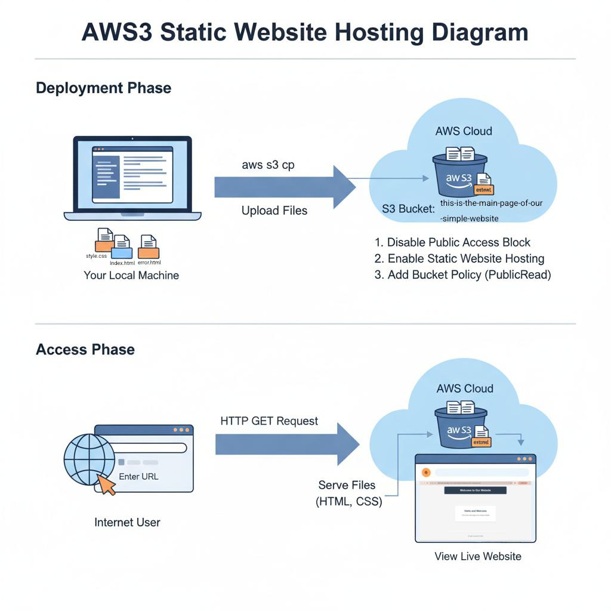
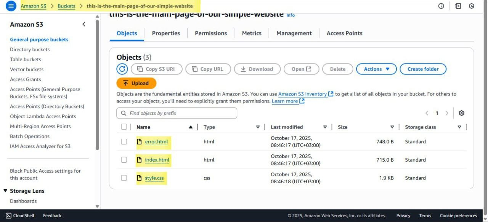

# Static Website Hosting on AWS S3

A simple project demonstrating how to deploy and host a static website using Amazon Web Services (AWS) S3. This repository contains the source code for a basic website consisting of HTML and CSS files.
Project Goal
The main objective of this project is to learn and apply the fundamentals of cloud hosting by leveraging AWS S3's static website hosting feature. It covers creating an S3 bucket, configuring it for public access, and applying the necessary permissions to serve web content directly from S3.
Technologies Used
 * AWS S3 (Simple Storage Service): Used for storing the website assets (index.html, style.css, error.html) and serving them as a static website.
 * HTML5
 * CSS3
Architecture Diagram
The following diagram illustrates the process, from uploading the files to a user accessing the live website.

How It Works
 * File Storage: The website files (index.html, style.css, error.html) are uploaded to a designated S3 bucket.
 * Bucket Configuration: The S3 bucket is configured with the following settings:
   * Static Website Hosting: This feature is enabled on the bucket, with index.html set as the index document and error.html as the error document.
   * Public Access: The "Block all public access" setting is disabled to allow users on the internet to view the content.
   * Bucket Policy: A JSON policy is applied to the bucket to grant public read-only access (s3:GetObject) to all objects within it.
 * User Access: When a user navigates to the unique S3 website endpoint URL, S3 serves the index.html file. The user's browser then requests the linked style.css file, which S3 also provides, rendering the complete webpage.
Live Demo
You can view the live website here:
[http://this-is-the-main-page-of-our-simple-website.s3-website.eu-north-1.amazonaws.com]
